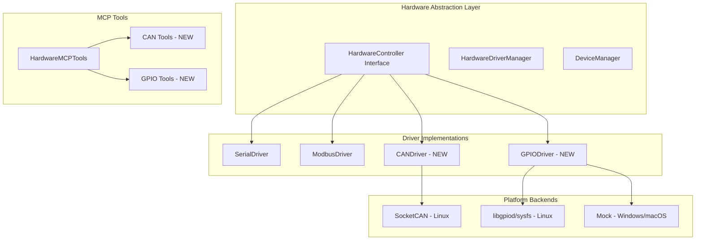

## 用户需求

为AgentFramework添加CAN总线和GPIO硬件支持。

## 产品概述

扩展AgentFramework的硬件抽象层，添加CAN总线通信和GPIO控制功能，使Agent能够直接与嵌入式设备、传感器、执行器等硬件交互。

## 核心功能需求

### CAN总线支持

- **帧类型支持**: 标准帧(11位ID)和扩展帧(29位ID)
- **波特率配置**: 支持125K, 250K, 500K, 1M等常见波特率
- **消息收发**: 单帧发送、批量发送、接收、过滤接收
- **过滤器配置**: 支持掩码过滤和范围过滤
- **错误处理**: 总线错误检测和恢复

### GPIO支持

- **引脚控制**: 数字输入、数字输出、引脚方向配置
- **PWM输出**: 支持脉宽调制输出
- **中断/事件**: 支持引脚变化中断监听
- **多平台支持**: 
- Linux: 使用sysfs或libgpiod
- Windows: 模拟实现(或通过WSL)
- macOS: 模拟实现

### 集成需求

- 遵循现有硬件抽象接口`HardwareController`
- 在`HardwareAgent`中注册新驱动
- 扩展`HardwareMCPTools`暴露CAN/GPIO操作
- 提供单元测试和示例代码

## 技术栈选择

### CAN总线库

- **github.com/brutella/can**: 支持Linux SocketCAN，轻量级，活跃维护
- 备选: github.com/einride/can (更现代的设计)

### GPIO库

- **Linux**: github.com/warthog618/gpiod (libgpiod绑定，推荐) 或 sysfs (传统方案)
- **Windows/macOS**: 模拟实现，提供接口兼容性

### 技术架构

### 系统架构



### 模块划分

- **CAN Driver Module**: 实现CAN总线通信协议
- **GPIO Driver Module**: 实现GPIO引脚控制
- **MCP Tools Extension**: 添加CAN和GPIO相关MCP工具
- **Hardware Agent Update**: 注册新驱动到硬件代理
- **Test Suite**: 单元测试和集成测试

### 关键数据结构

#### CAN配置

```
type CANDeviceConfig struct {
    Interface   string // can0, can1等
    BaudRate    int    // 125000, 250000, 500000, 1000000
    Timeout     int    // 毫秒
    EnableFD    bool   // 支持CAN FD
    Filters     []CANFilter // 接收过滤器
}

type CANFrame struct {
    ID         uint32 // 标准11位或扩展29位
    IsExtended bool   // 是否为扩展帧
    IsRemote   bool   // 是否为远程帧
    Data       []byte // 0-8字节(标准)或0-64字节(FD)
    Timestamp  int64  // 接收时间戳
}

type CANFilter struct {
    ID    uint32 // 过滤ID
    Mask  uint32 // 掩码
}
```

#### GPIO配置

```
type GPIODeviceConfig struct {
    Chip      string // gpiochip0
    Pin       int    // 引脚号
    Direction string // in, out
    Edge      string // none, rising, falling, both
    ActiveLow bool   // 是否低电平有效
    Pull      string // up, down, off
}

type GPIOPin struct {
    Chip  string
    Pin   int
    Value int // 0或1
}
```

## 实现细节

### 依赖管理

- **CAN**: `go get github.com/brutella/can`
- **GPIO**: `go get github.com/warthog618/gpiod`

### 跨平台策略

- **Linux**: 完整功能(SocketCAN + libgpiod)
- **Windows**: GPIO模拟实现(返回错误或使用WSL2)
- **macOS**: GPIO模拟实现(返回错误)

### 错误处理

- 使用Go标准错误处理模式
- 提供详细的错误上下文
- 支持错误恢复机制

### 性能考虑

- CAN接收使用goroutine监听
- GPIO中断使用事件驱动
- 批量操作支持减少系统调用

## Agent Extensions

### SubAgent

- **code-explorer**
- Purpose: 探索项目代码结构，定位修改目标文件
- Expected outcome: 确定hardware包中需要修改的具体文件位置

### Skill

- **golang-pro**
- Purpose: 指导Go并发编程和硬件驱动开发最佳实践
- Expected outcome: 生成高质量的CAN和GPIO驱动代码

### MCP

- **GitHub MCP Server**
- Purpose: 获取Go CAN/GPIO库的API参考和示例代码
- Expected outcome: 了解github.com/brutella/can和github.com/warthog618/gpiod的使用方法